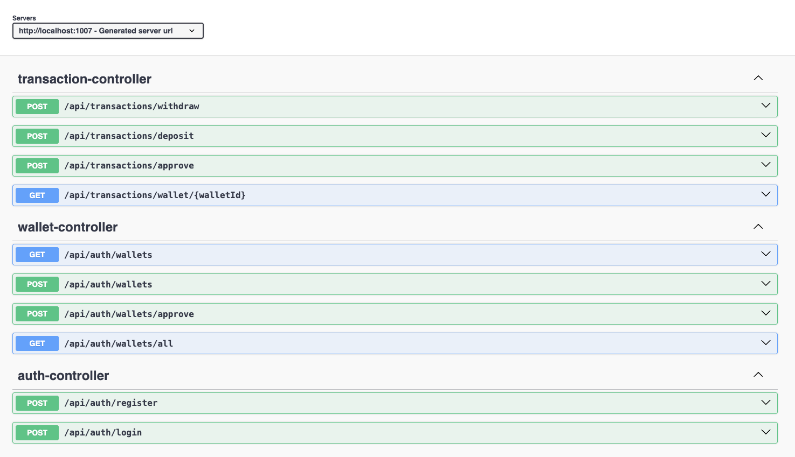
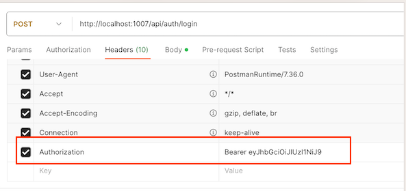

# Digital-Wallet-Service

## Overview
💰 Digital Wallet API – Spring Boot Project

A secure and role-based backend wallet API built for a digital payment company challenge. The system enables customers and employees to:

- Create and manage wallets

- Deposit or withdraw funds

- Approve or deny transactions

- Track transaction history

JWT-based authentication and Spring Security are used for secure access control.

🔐 [Try out JWT tokens online](https://jwt.tplant.com.au)

## 🚀 Tech Stack
- Java 17

- Spring Boot 3.5.4

- Spring Web

- Spring Data JPA

- Spring Security

- JWT (JJWT)

- MySQL

- Bean Validation (Jakarta)

- Swagger (springdoc-openapi)

- JUnit

- Spring Security Test

- Spring Boot DevTools

- Maven


## 🧾 Features
✅ Wallet creation & listing

✅ Deposit / Withdraw operations

✅ Transaction approval flow

✅ Role-based access (CUSTOMER vs EMPLOYEE)

✅ JWT authentication & authorization

✅ Swagger API documentation


## 🔑 Roles & Permissions

| Operation           | CUSTOMER (self) | EMPLOYEE (all users) |
|---------------------| --------------- | -------------------- |
| Register/Login      | ✅               | ✅                    |
| Create Wallet       | ✅               | ✅                    |
| Deposit             | ✅               | ✅                    |
| Withdraw            | ✅               | ✅                    |
| Approve Transaction | ❌               | ✅                    |


## 📌 Business Rules
- Amount ≤ 1000 → _APPROVED_

- Amount > 1000 → _PENDING_ (requires approval)

- **CUSTOMER** can only act on their own wallets

- **EMPLOYEE** can act on all wallets


## Getting Started
### 1. Clone & Build
```
git clone <repository-url>
cd digital-wallet-api
mvn clean install
```
### 2. Run the App
```
mvn spring-boot:run
```
### 3. Port Configuration
The application runs on the port specified in `application.properties`.  
By default, Spring Boot uses port `8080`, but in this project, we set:

_application.properties_
```
server.port=1007
```

App will start at: http://localhost:1007 


## 🗄️ Database Configuration (MySQL)

Update your application.properties file:
```
# ---------------------------
# Database Configuration (MySQL)
# ---------------------------
spring.datasource.url=jdbc:mysql://localhost:3306/digital_wallet
spring.datasource.username=your_mysql_username
spring.datasource.password=your_mysql_password
```

📌 Make sure that the digital_wallet database exists in your MySQL instance.
You can create it manually or use the provided init.sql file.

If you want to use a different database name, feel free to change the digital_wallet part in the spring.datasource.url, and update the corresponding SQL file accordingly.


## 📄 Swagger UI
Interactive API documentation is available at:

👉 http://localhost:1007/swagger-ui/index.html#/

Screenshot from Swagger




>  ℹ️ Port 1007 is used by default in this project. If you change the port in application.properties, update the URL accordingly.

## 🔐 JWT Auth
All protected endpoints require a JWT token.

After logging in via /api/auth/login, you will receive a token like this:

```json
{
  "token": "eyJhbGciOiJIUzI1NiJ9..."
}
```
Include this token in the _Authorization_ header of every authenticated request:

```http
Authorization: Bearer <your_token>
```
> ℹ️ In Postman, go to the "Authorization" tab, choose "Bearer Token", and paste the token there.

### 🧷 Example (Postman)
| Key           | Value                 |
| ------------- | --------------------- |
| Authorization | Bearer `<your_token>` |





### 🔐 How to generate a JWT secret key

See: [🔐 JWT Secret Instructions](https://www.jwt.io/introduction)

## 🔐 JWT Secret <a name="jwt-secret"></a>
Generate a secure JWT secret:

### Java Code

```java
Key key = Keys.secretKeyFor(SignatureAlgorithm.HS256);
String base64Key = Encoders.BASE64.encode(key.getEncoded());
```

### Terminal (OpenSSL)
```bash
openssl rand -base64 64
```
Paste the result into:

```properties
jwt.secret=your_generated_secret
```

---

## 🧱 Data Model

### Customer
| Column   | Type   |
| -------- | ------ | 
| id       | Long   | 
| name     | String | 
| surname  | String | 
| password | String | 
| tckn     | String |

### Employee
| Column   | Type   | 
| -------- | ------ | 
| id       | Long   | 
| name     | String |            
| surname  | String |   
| password | String | 
| email    | String |

### Wallet

| Column            | Type               | 
| ----------------- | ------------------ |
| id                | Long               | 
| walletName        | String             |  
| currency          | Enum (TRY/USD/EUR) |  
| activeForShopping | Boolean            | 
| activeForWithdraw | Boolean            | 
| balance           | BigDecimal         | 
| usableBalance     | BigDecimal         | 
| customer\_id      | Long               | 

### Transaction
| Column            | Type                           | 
| ----------------- | ------------------------------ | 
| id                | Long                           | 
| amount            | BigDecimal                     |                  
| type              | Enum (DEPOSIT/WITHDRAW)        |                    
| oppositeParty     | String                         |                  
| oppositePartyType | Enum (IBAN/PAYMENT)            |                  
| status            | Enum (PENDING/APPROVED/DENIED) |           
| createdAt         | LocalDateTime                  | 
| wallet\_id        | Long                           | 


## 📘 Entity Relationships
The core data model follows a relational structure with the following associations:

A Customer can have multiple Wallets (1:N).

A Wallet can contain multiple Transactions (1:N).

An Employee is independent and used only for system-level operations. It is not directly linked to Wallet or Transaction.

```plaintext
Customer (1) ──────────< (N) Wallet ──────────< (N) Transaction
                         ^                          
                         |                          
                  customer_id          
``` 

### 📌 Relationship Summary

| Entity   | Related Entity | Relationship | Description                                |
| -------- | -------------- | ------------ | ------------------------------------------ |
| Customer | Wallet         | 1 to Many    | A customer may have multiple wallets       |
| Wallet   | Transaction    | 1 to Many    | A wallet may contain multiple transactions |
| Employee | —              | None         | Standalone entity for admin actions        |


----
## 🔧 API Usage
## 👤 CUSTOMER FLOW
### ✅ 1. AUTH ENDPOINTS
#### 🔸 Register (CUSTOMER)
```http
POST /api/auth/register
```

```json
{
  "name": "Ali",
  "surname": "Yılmaz",
  "tckn": "19845678901",
  "password": "123456",
  "role": "CUSTOMER"
}
```
#### 🔸 Login (CUSTOMER)

```http
POST /api/auth/login
```

```json
{
  "tckn": "19845678901",
  "password": "123456",
  "role": "CUSTOMER"
}
```

##### ✅ Token response:
```json
{
  "token": "eyJhbGciOiJIUzI1NiJ9..."
}
```
### ✅ 2. WALLET ENDPOINTS
#### 🔸 Create Wallet

```http
POST /api/auth/wallets
```

```json
{
  "walletName": "Ali's Wallet",
  "currency": "TRY",
  "activeForShopping": true,
  "activeForWithdraw": true
}
```

##### 🔸 Response:

```json
{
  "id": 4,
  "walletName": "Ali's Wallet",
  "currency": "TRY",
  "activeForShopping": true,
  "activeForWithdraw": true,
  "balance": 0,
  "usableBalance": 0
}
```
##### 🔸 List Wallets
```http
GET /api/auth/wallets
```
##### 🔸 Response:

```json
[
  {
    "id": 4,
    "walletName": "Ali's Wallet",
    "currency": "TRY",
    "activeForShopping": true,
    "activeForWithdraw": true,
    "balance": 0.00,
    "usableBalance": 0.00
  },
  {
    "id": 5,
    "walletName": "Ali's EUR Wallet",
    "currency": "EUR",
    "activeForShopping": true,
    "activeForWithdraw": true,
    "balance": 0.00,
    "usableBalance": 0.00
  }
]
```
> ℹ️ Only authenticated customer's own wallets are returned. EMPLOYEE can access all wallets.


### ✅ 3. TRANSACTION ENDPOINTS
#### 🔸 Deposit Funds
```http
POST /api/transactions/deposit
```

```json
{
  "walletId": 4,
  "amount": 1200,
  "oppositeParty": "TR11110000",
  "oppositePartyType": "IBAN"
}
```
##### 🔸 Response (amount > 1000 is PENDING):

```json
{
  "id": 8,
  "walletId": 4,
  "amount": 1200,
  "type": "DEPOSIT",
  "oppositePartyType": "IBAN",
  "oppositeParty": "TR11110000",
  "status": "PENDING",
  "createdAt": "2025-08-03T20:02:48.048224"
}
```
##### 🔸 Deposit Example (Approved):
```json
{
  "walletId": 4,
  "amount": 100,
  "oppositeParty": "TR11110000",
  "oppositePartyType": "IBAN"
}
```

```json
{
  "id": 9,
  "walletId": 4,
  "amount": 100,
  "type": "DEPOSIT",
  "status": "APPROVED",
  "createdAt": "2025-08-03T20:03:25.603124"

}
```
##### 🔸 Withdraw Funds

```http
POST /api/transactions/withdraw
```

```json
{
  "walletId": 4,
  "amount": 10,
  "oppositeParty": "TR11110000",
  "oppositePartyType": "IBAN"
}
```


##### 🔸 List Wallet Transactions
```http
GET /api/transactions/wallet/4
```
-----

## 👨‍💼 EMPLOYEE FLOW
### ✅ 1. Register (EMPLOYEE)

```http
POST /api/auth/register
```

```json
{
  "name": "Kemal",
  "surname": "Yildiz",
  "email": "kemal.yildiz@company.com",
  "password": "123456",
  "role": "EMPLOYEE"
}

```

### ✅ 2. Login (EMPLOYEE)
```http
POST /api/auth/login
```

```json
{
  "email": "kemal.yildiz@company.com",
  "password": "123456",
  "role": "EMPLOYEE"
}
```

### ✅ 3. List All Customers' Wallets
```http
GET /api/auth/wallets/all
```
##### 🔸 Response:

```json
[
    {
        "customerId": 1,
        "name": "Janice",
        "surname": "Albright",
        "tckn": "12345678900",
        "wallets": [
            {
                "id": 1,
                "walletName": "Janice Main Wallet",
                "currency": "USD",
                "activeForShopping": true,
                "activeForWithdraw": true,
                "balance": 22600.00,
                "usableBalance": 600.00
            },
            {
                "id": 2,
                "walletName": "Janice TRY Wallet",
                "currency": "TRY",
                "activeForShopping": true,
                "activeForWithdraw": true,
                "balance": 0.00,
                "usableBalance": 0.00
            },
            {
                "id": 3,
                "walletName": "Janice EUR Wallet",
                "currency": "EUR",
                "activeForShopping": true,
                "activeForWithdraw": true,
                "balance": 0.00,
                "usableBalance": 0.00
            }
        ]
    },
    {
        "customerId": 2,
        "name": "Ali",
        "surname": "Kaya",
        "tckn": "15345678901",
        "wallets": []
    },

    {
        "customerId": 6,
        "name": "Ali",
        "surname": "Yılmaz",
        "tckn": "19845678901",
        "wallets": [
            {
                "id": 4,
                "walletName": "Ali's Wallet",
                "currency": "TRY",
                "activeForShopping": true,
                "activeForWithdraw": true,
                "balance": 2080.00,
                "usableBalance": 880.00
            },
            {
                "id": 5,
                "walletName": "Ali's EUR Wallet",
                "currency": "EUR",
                "activeForShopping": true,
                "activeForWithdraw": true,
                "balance": 0.00,
                "usableBalance": 0.00
            }
        ]
    }
]
```

### ✅ 4. List Wallets by Customer ID
```http
GET /api/auth/wallets?customerId=6
```
##### 🔸 Response:

```json
  {
        "id": 5,
        "walletName": "Ali's EUR Wallet",
        "currency": "EUR",
        "activeForShopping": true,
        "activeForWithdraw": true,
        "balance": 0.00,
        "usableBalance": 0.00
    }
```
### ✅ 5. Create Wallet for Any Customer
```http
POST /api/auth/wallets?customerId=6
```
##### 🔸 Response:

```json
 {
        "id": 5,
        "walletName": "Ali's EUR Wallet",
        "currency": "EUR",
        "activeForShopping": true,
        "activeForWithdraw": true,
        "balance": 0.00,
        "usableBalance": 0.00
    }
```

### ✅ 6. Deposit to Any Wallet

```http
POST /api/transactions/deposit
```

```json
{
  "walletId": 1, 
  "amount": 500,
  "oppositeParty": "TR11110000",
  "oppositePartyType": "IBAN"
}
```
##### 🔸 Response:

```json
{
    "id": 14,
    "walletId": 1,
    "amount": 500,
    "type": "DEPOSIT",
    "oppositePartyType": "IBAN",
    "oppositeParty": "TR11110000",
    "status": "APPROVED",
    "createdAt": "2025-08-03T20:53:33.428225"
}
```

### ✅ 7. Withdraw from Any Wallet

```http
POST /api/transactions/withdraw
```

```json
{
  "walletId": 4, 
  "amount": 50,
  "oppositeParty": "TR11110000",
  "oppositePartyType": "IBAN"
}
```

##### 🔸 Response:

```json
{
    "id": 16,
    "walletId": 4,
    "amount": 50,
    "type": "WITHDRAW",
    "oppositePartyType": "IBAN",
    "oppositeParty": "TR11110000",
    "status": "APPROVED",
    "createdAt": "2025-08-03T20:55:21.566834"
}
```

### ✅ 8. Approve or Deny Transactions

```http
POST /api/transactions/approve
```
_Approve example:_

```json
{
  "transactionId": 2,
  "status": "APPROVED"
}
```

_Deny example:_


```json
{
  "transactionId": 6,
  "status": "DENIED"
}
```


### ✅ 9. List Transactions of Any Wallet

```http
GET /api/transactions/wallet/{walletId}
```

```http
GET /api/transactions/wallet/4
```

```json

[
    {
        "id": 8,
        "walletId": 4,
        "amount": 1200.00,
        "type": "DEPOSIT",
        "oppositePartyType": "IBAN",
        "oppositeParty": "TR11110000",
        "status": "PENDING",
        "createdAt": "2025-08-03T20:02:48.048224"
    },
    {
        "id": 9,
        "walletId": 4,
        "amount": 100.00,
        "type": "DEPOSIT",
        "oppositePartyType": "IBAN",
        "oppositeParty": "TR11110000",
        "status": "APPROVED",
        "createdAt": "2025-08-03T20:03:25.603124"
    },
    {
        "id": 10,
        "walletId": 4,
        "amount": 100.00,
        "type": "WITHDRAW",
        "oppositePartyType": "IBAN",
        "oppositeParty": "TR11110000",
        "status": "APPROVED",
        "createdAt": "2025-08-03T20:04:38.922839"
    },
    {
        "id": 11,
        "walletId": 4,
        "amount": 900.00,
        "type": "DEPOSIT",
        "oppositePartyType": "IBAN",
        "oppositeParty": "TR11110000",
        "status": "APPROVED",
        "createdAt": "2025-08-03T20:06:03.964106"
    },
    {
        "id": 12,
        "walletId": 4,
        "amount": 10.00,
        "type": "WITHDRAW",
        "oppositePartyType": "IBAN",
        "oppositeParty": "TR11110000",
        "status": "APPROVED",
        "createdAt": "2025-08-03T20:06:22.351037"
    },
    {
        "id": 13,
        "walletId": 4,
        "amount": 10.00,
        "type": "WITHDRAW",
        "oppositePartyType": "IBAN",
        "oppositeParty": "TR11110000",
        "status": "APPROVED",
        "createdAt": "2025-08-03T20:06:46.612521"
    },
    {
        "id": 16,
        "walletId": 4,
        "amount": 50.00,
        "type": "WITHDRAW",
        "oppositePartyType": "IBAN",
        "oppositeParty": "TR11110000",
        "status": "APPROVED",
        "createdAt": "2025-08-03T20:55:21.566834"
    }
]
```

All requests require a valid JWT token in the Authorization header like this:
Authorization: Bearer <your_token_here>


## 🧪 Test Scenarios

### CUSTOMER
| Step                  | Description                      | Expected Result |
| --------------------- | -------------------------------- | --------------- |
| ✅ Register            | Register as `CUSTOMER`           | JWT token       |
| ✅ Login               | Login with TCKN and password     | JWT token       |
| ✅ Create Wallet       | `POST /api/wallets`              | 200 OK          |
| ✅ Deposit ≤ 1000      | Transaction status is `APPROVED` | ✅               |
| ✅ Deposit > 1000      | Transaction status is `PENDING`  | ✅               |
| ✅ View own wallets    | `GET /api/wallets`               | Wallet list     |
| ❌ Approve Transaction | Only EMPLOYEE can approve        | 403 Forbidden   |
| ❌ Create for others   | CUSTOMER can’t create for others | 403 Forbidden   |

### EMPLOYEE

| Step                         | Description                               | Expected Result  |
| ---------------------------- | ----------------------------------------- | ---------------- |
| ✅ Register/Login             | Register and login as `EMPLOYEE`          | JWT token        |
| ✅ List all wallets           | `GET /api/wallets/all`                    | Full wallet list |
| ✅ Create wallet for customer | Provide `customerId` in request           | Wallet created   |
| ✅ Deposit for any wallet     | `POST /api/transactions/deposit`          | 200 OK           |
| ✅ Withdraw on behalf of user | `POST /api/transactions/withdraw`         | 200 OK           |
| ✅ Approve transaction        | `POST /api/transactions/approve`          | 200 OK           |
| ✅ View wallet transactions   | `GET /api/transactions/wallet/{walletId}` | Transaction list |


## 📚 API Endpoint Summary

### 🔐 Authentication

| Method | Endpoint             | Description                                  |
| ------ | -------------------- | -------------------------------------------- |
| POST   | `/api/auth/register` | Register new user (`CUSTOMER` or `EMPLOYEE`) |
| POST   | `/api/auth/login`    | Login with credentials and receive JWT       |


### 💼 Wallets

| Method | Endpoint           | Description                                                                                     |
| ------ | ------------------ | ----------------------------------------------------------------------------------------------- |
| POST   | `/api/wallets`     | Create wallet for logged-in user (CUSTOMER) or any user with `customerId` (EMPLOYEE)            |
| GET    | `/api/wallets`     | List wallets: <br> • CUSTOMER sees only own wallets<br> • EMPLOYEE can filter with `customerId` |
| GET    | `/api/wallets/all` | EMPLOYEE sees all customers and their wallets                                                   |

### 💸 Transactions

| Method | Endpoint                              | Description                                 |
| ------ | ------------------------------------- | ------------------------------------------- |
| POST   | `/api/transactions/deposit`           | Deposit funds into wallet                   |
| POST   | `/api/transactions/withdraw`          | Withdraw funds from wallet                  |
| POST   | `/api/transactions/approve`           | Approve or deny transaction (EMPLOYEE only) |
| GET    | `/api/transactions/wallet/{walletId}` | Get transactions for specific wallet        |


> ℹ️ You can find real usage examples and sample JSON request/response bodies in the 🧪 Test Scenarios section above.

---

## 👩‍💻 Developer Info

**👩 Author:** Eda Kaş  
**📧 Contact:** eda.kas60@gmail.com  
**🔗 LinkedIn:** [linkedin.com/in/edakas](https://www.linkedin.com/in/eda-ka%C5%9F-289943180/)  
**💻 GitHub:** [github.com/edakas](https://github.com/edakass)  
**✍️ Medium:** [medium.com/@edakas](https://medium.com/@edakas)